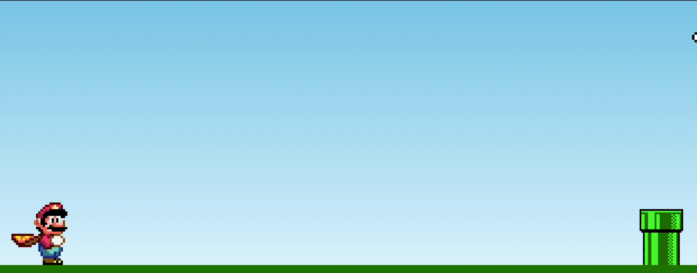
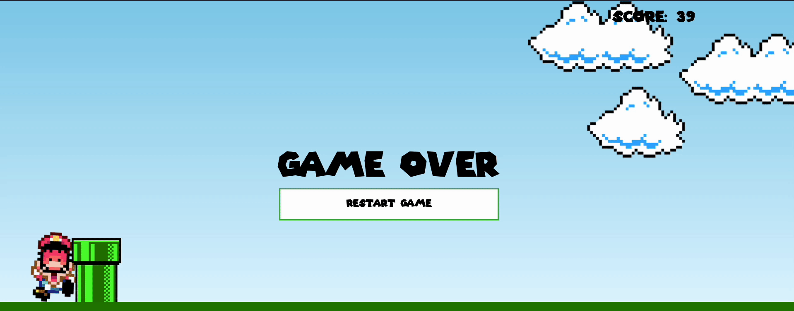

> [English version](README.md)

# AULA

- Jogo do Mario — pressione espaço para saltar os obstáculos. Ensina manipulação de DOM, animações CSS, detecção de colisão com `setInterval` e tratamento de eventos de teclado.

# [DESAFIO 01](./challenge-1/README-PTBR.md)

- Adicionar um contador de pontuação que incrementa enquanto o jogo está rodando.

# [DESAFIO 02](./challenge-2/README-PTBR.md)

- Adicionar uma tela de game-over com botão de reinício para jogar novamente.

[Voltar](../README-PTBR.md)